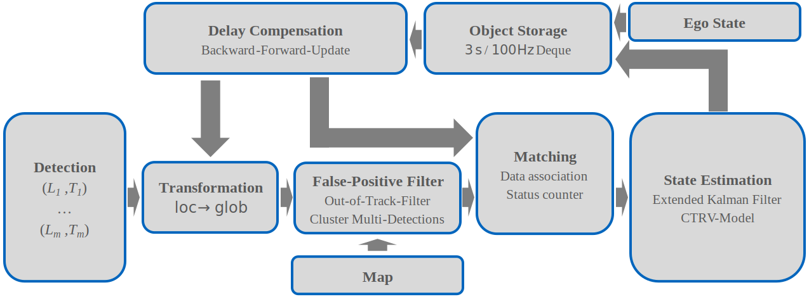
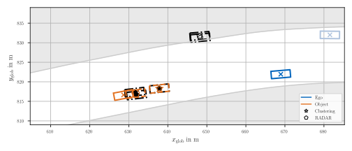

[](https://doi.org/10.5281/zenodo.7220719)
[](https://www.linux.org/)
[](https://www.docker.com/)
[](https://docs.ros.org/en/galactic/index.html)
[](https://www.python.org/downloads/release/python-380/)

# Multi-Modal Sensor Fusion and Object Tracking
The following figure outlines the high level structure of the algorithm, which covers the tasks of multi-modal sensor fusion and object tracking. The algorithm is developed for the [Indy Autonomous Challenge 2021](https://www.indyautonomouschallenge.com/) and the [Autonomous Challenge at CES 2022](https://www.indyautonomouschallenge.com/stream) and is part of the software of TUM Autonomous Motorsport.



The sensor fusion handles multiple object lists that originate from different perception pipelines. The perception pipelines work independently from each other and output individual object lists. This algorithm combines the given information to output a unified object list. This late fusion approach allows us to incorporate a variable number of perception pipelines without any dependencies. 

The object tracking addresses the estimation of the detected objects' dynamic states, which is realized by an Extended Kalman Filter (EKF) based on a constant turn-rate and velocity (CTRV)-model.

### Requirements
- OS: `Ubuntu 22.04 LTS`
- Docker: `20.10.17`
- Docker Compose: `v2.6.1`
- Python: `3.8`
- ROS2: `galactic`

## Installation

Clone repository:
```
git clone https://github.com/TUMFTM/FusionTacking.git
```

Setup virtual environment and install requirements:
```
python3.8 -m venv venv
source venv/bin/activate
pip install -r requirements.txt
```

Install tex extensions, necessary to plot with desired font:
```
sudo apt-get install texlive-latex-extra texlive-fonts-recommended dvipng cm-super
```


## Data and Evaluation
The evaluation is entirely conducted with real-world data of team TUM Autonomous Motorsport from the [AC@CES 2022](https://www.indyautonomouschallenge.com/stream). The recorded raw data of all tracking inputs stored in rosbags is available open-source ([Link](https://doi.org/10.5281/zenodo.7220695), uncompressed size: 16.4 GB). The data processing and evaluation procedure is described in the [README](evaluation/README.md). Follow the described steps to reproduce the evaluation.


## Docker Image
It is recommended to run the ROS2 node of the module in a Docker container. To build the related image, execute:
```
docker build --pull --tag <image_name>:<tag> .
# e.g. docker build --pull --tag tracking:0.0.1 .
```
To run the container and launch the ROS2 node, run:
```
docker run <image_name>:<tag> ros2 launch tracking tracking.launch.py
# e.g. docker run tracking:0.0.1 ros2 launch tracking tracking.launch.py
```
It is recommended to mount a volume to save the logs during the node runs (see [replay.yml](evaluation/bag_play/replay.yml) for an example).
Add additional parameters to the ros2 launch command if desired, see section `Parameter and Files` below. For further details about Docker and ROS2, we refer to the official documentations.


## Parameter and Files
### Directory: `tracking`
The directory `tracking` contains the source code (subfolder: `tracking`) and ROS2 launch configuration (subfolder: `launch`) of the module. 

| Files | Description |
| ------------------ | ----------------------- |
`tracking/tracking_node.py` | ROS2 main file to apply the MixNet
`launch/tracking.launch.py` | ROS2 launch file with parameter definition

The [launch description](tracking/launch/tracking.launch.py) contains the following parameters:

| Parameter | Type | Default | Description
| ------------- | ------------- | ----- | ----- |
frequency | float, int | 50.0 Hz | Cycle frequency of the ROS2 node |
max_delay_ego_s | float | 0.15 s | Threshold for ego state message delay |
checks_enabled | boolean | False | If true failed safety checks trigger emergency state of the module |
track | string | LVMS | Name of used race track map |
use_sim_time | boolean | False | Flag to use sim time instead of system time
ego_raceline | string | default | String of used ego raceline of motion planner (default, inner, outer, center)
send_prediction | boolean | True | If true a prediction is published

Add them at the end of the `docker run`-command. Example with modified frequency and enabled safety checks:
```
docker run tracking:0.0.1 ros2 launch tracking tracking.launch.py frequency:=100.0 checks_enabled:=True
```

### Directory: `tools`
The directory `tools` contains the script to visualize logged data of the applied ROS2 Node. To visualize logged data of the tracking-node run:
```
python tools/visualize_logfiles.py
```
Logs must be stored in `tracking/tracking/logs` to be considered. Enter the number of the desired log or hit `enter` to run the latest.
Add additional arguments if desired. Without any argument the overall tracking process will be shown (always recommended at first).

Additional Arguments:
- `--n_obs`: Specifies the number of objects to show filter values / states of (default: 5)
- `--filter`: Visualizes filter values of the <n_obs>-most seen objects (default: False)
- `--states`: Visualizes the dynamic states of the <n_obs>-most seen objects (default: False)
- `--mis_num_obj`: Visualizes the matching performance (default: False)

## Module configuration
Besides the ROS2 parameter, which are changeable during runtime, there is an additional configuration file for all static parameters (i.e. not changeable during runtime). This config is stored in [main_config_tracking.ini](tracking/tracking/config/main_config_tracking.ini). A parameter description is given in the related [README](tracking/tracking/config/README.md).


## Qualitative Example
Below is an exemplary visualization of the fusion and tracking algorithm on the Las Vegas Motor Speedway. The input are the object lists of the LiDAR and the RADAR.
The raw perception input is filtered for objects outside the driveable area and it is checked if there are multiple detections of the same object. Afterwards a distance-based matching associates the multi-modal object lists to the currently tracked objects. A kinematic tracking model based on an Extended Kalman Filter (EKF) is applied to optimize the state estimation. Additionally, the perception delay is compensated by backward-forward integration of the kinematic model to output an updated object list.
The validation under real-world condition in autonomous racing with a stable object fusion and tracking at a maximum speed of 270 km/h proves the robustness of the proposed approach.



## Inference time
The average computation time of the module during the evaluation on the given data on a single core of an Intel i7-9850H 2.60 GHz CPU is 2.75 ms with a 90%-quantile of 5.26 ms.

## References
P. Karle, F. Fent, S. Huch, F. Sauerbeck and M. Lienkamp, "Multi-Modal Sensor Fusion and Object Tracking for Autonomous Racing," in IEEE Transactions on Intelligent Vehicles, doi: 10.1109/TIV.2023.3271624.

BibTex:
```
@ARTICLE{Karle2023,
  author={Karle, Phillip and Fent, Felix and Huch, Sebastian and Sauerbeck, Florian and Lienkamp, Markus},
  journal={IEEE Transactions on Intelligent Vehicles}, 
  title={Multi-Modal Sensor Fusion and Object Tracking for Autonomous Racing}, 
  year={2023},
  pages={1-13},
  doi={10.1109/TIV.2023.3271624}
}
```
